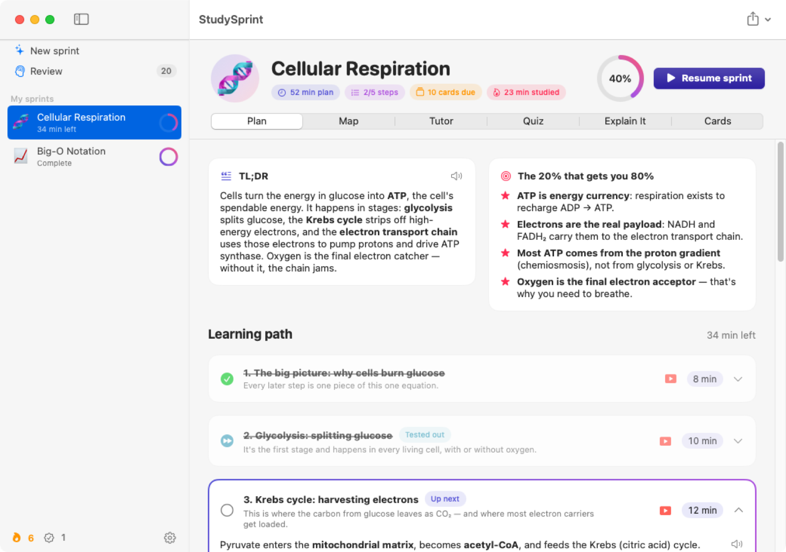
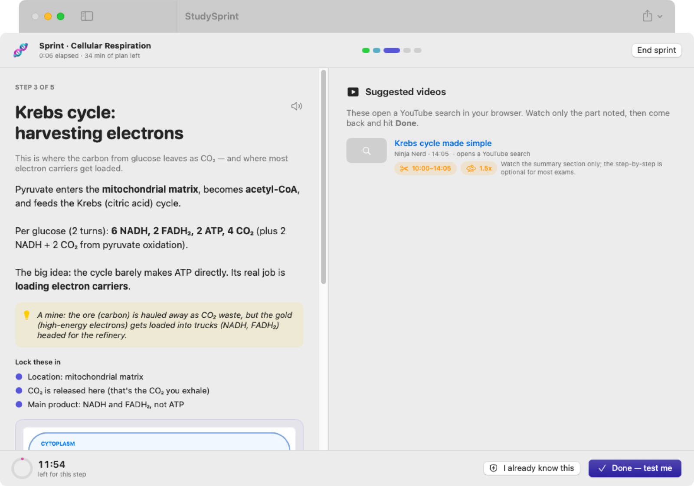
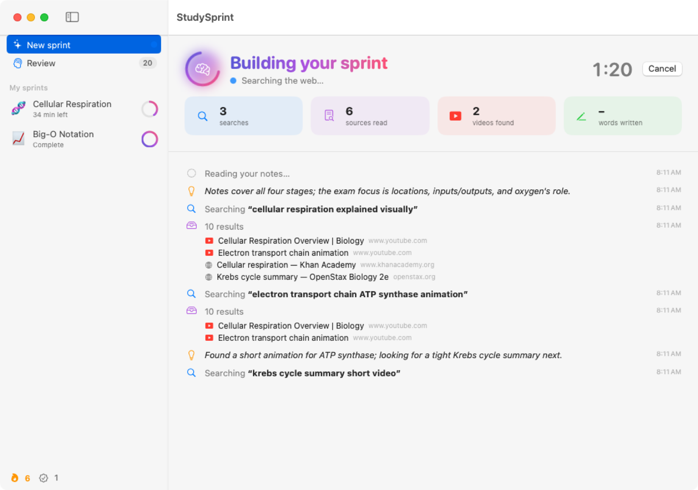
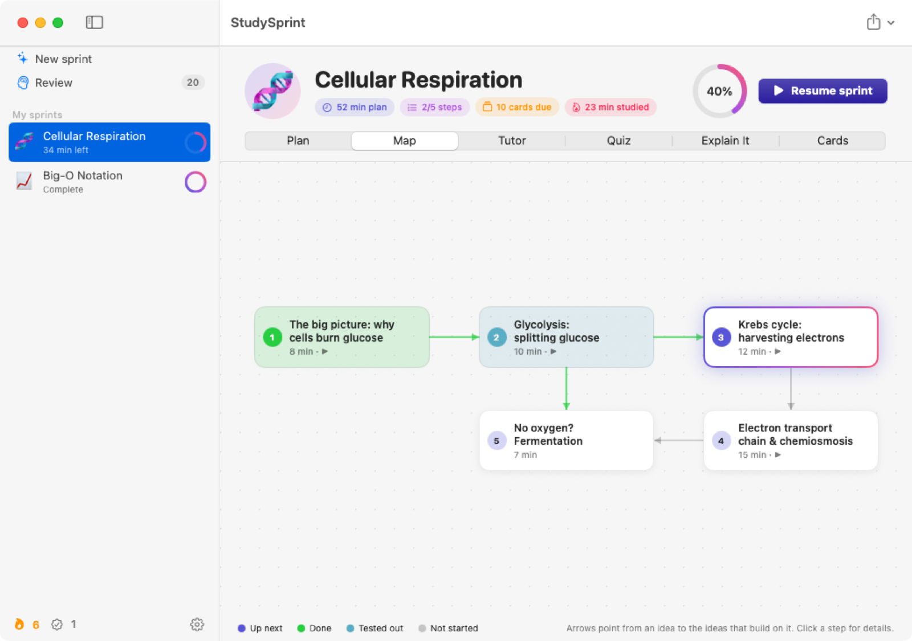
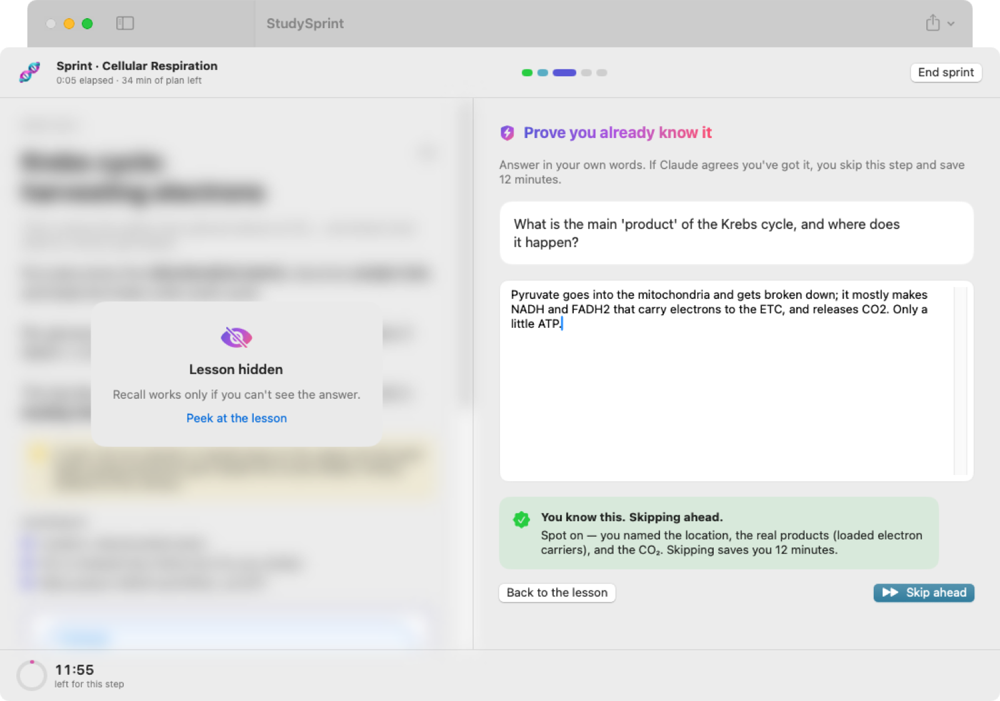
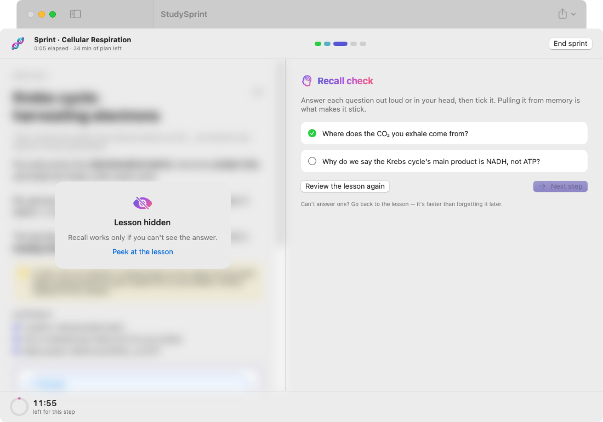
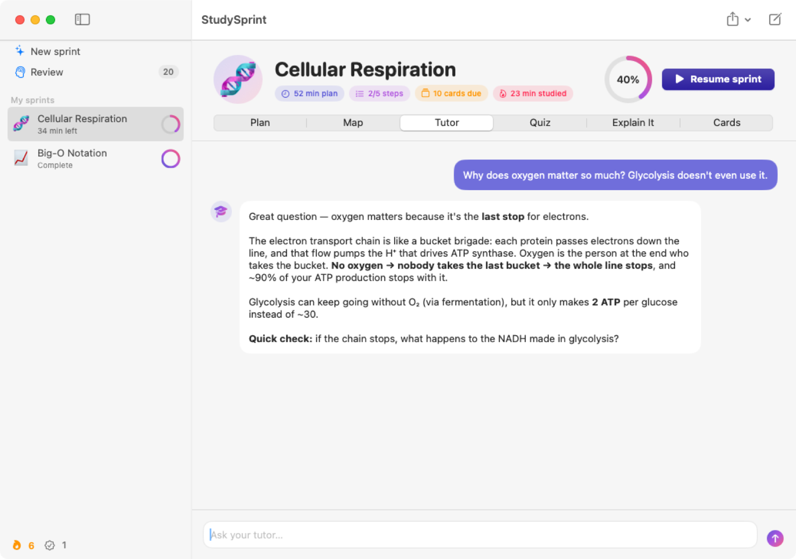
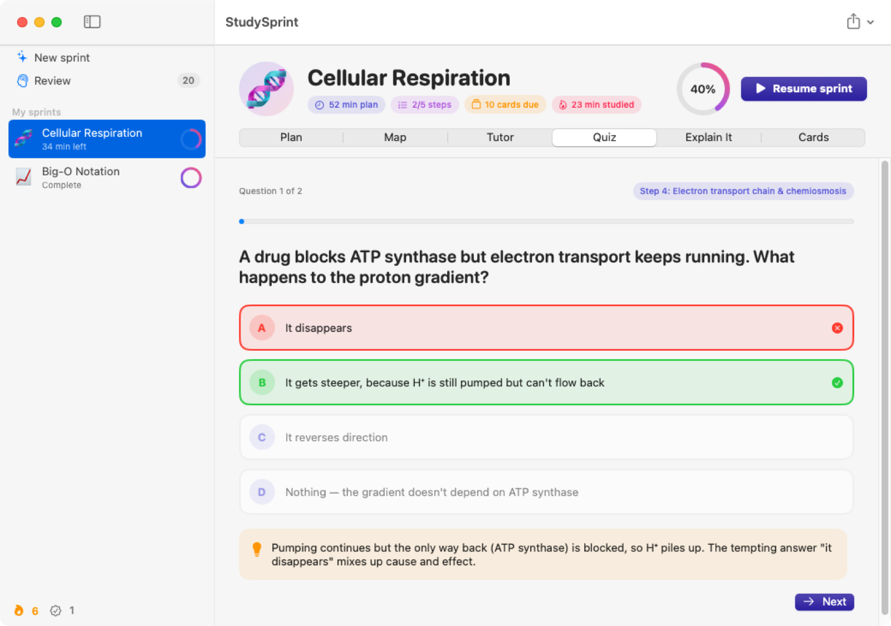
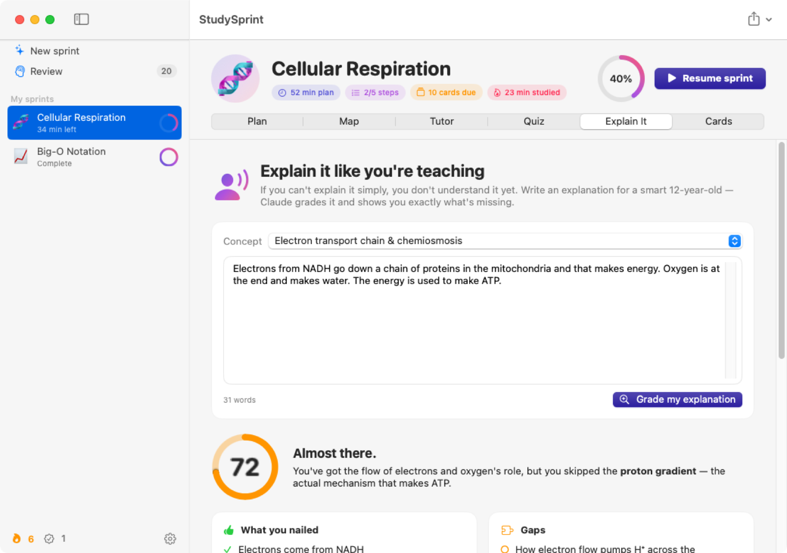
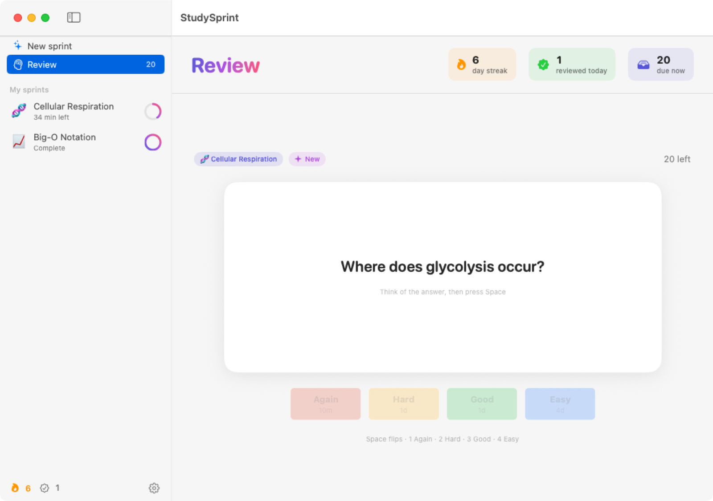

# StudySprint

**Learn anything in the least time possible.** A native macOS app: drop in your notes and Claude researches the topic live, finds the best videos (and exactly which minutes to watch, at what speed), and builds the shortest path to mastery. Then it teaches you through it, tests you, and keeps you from forgetting it.

<p align="center">
  
  
</p>

*Screenshots are captured automatically from the real app on a macOS CI runner.*

## What it does

| | |
|---|---|
| ⚡ **Live research** | Watch Claude work in real time: every web search, every source it reads, how many videos it finds. |
| 🎯 **80/20 study plan** | The few core ideas first, then a dependency-ordered path that fits your time budget (15 min → 1 day). Every step has a worked example, an analogy, key points and recall questions. |
| ▶️ **Videos, trimmed** | Videos play inside the app, starting at the segment that matters, at the suggested speed. Links are checked against real search results, so you never get a made-up link. |
| 🏃 **Sprint Mode** | Full-focus mode, one step at a time: lesson on the left, video on the right, a countdown per step. **Already know it?** Answer one question; if Claude agrees, you skip the step. Before moving on you pass a **recall check**. |
| 🗺️ **Knowledge map** | See how the ideas build on each other, colored by your progress. |
| 🎓 **AI tutor** | Chat with a tutor that knows your whole guide. It can re-explain, quiz you, or search for another video. |
| ✅ **Adaptive quizzes** | Fresh multiple-choice questions each time. Results show your weak steps, and one click hands them to the tutor to fix. |
| 🧑‍🏫 **Feynman mode** | Explain a concept in your own words; get a score, what you nailed, your gaps and misconceptions, and a tighter version. |
| 🧠 **Spaced repetition** | Flashcards scheduled with SM-2 across all your guides, a daily streak, a cram mode, and a menu-bar counter of cards due. |
| 📸 **Photos of notes** | Drop or paste photos of handwritten notes, or scanned PDFs. Claude reads them directly, diagrams included. |
| 🆘 **"Stuck?" buttons** | One click on any step: explain it simpler, give another example, explain why it matters, or quiz me. |
| 🔔 **Review reminders** | A notification when flashcards come due, so the spacing actually happens. |
| 📄 **Cheat sheet PDF** | A dense printable summary, plus Markdown export. |
| 🔊 **Read aloud** | Any explanation, read to you. |
| 💸 **Cost shown** | Each guide shows roughly what it cost to build. |
| 🧪 **Demo sprint** | Explore a complete sample sprint before you even add an API key. |

## Three ways to run it, none of them paid per guide unless you want that

| | **Free mode** | **Your Claude plan** | **Claude API** |
|---|---|---|---|
| Cost | **$0** | **Included in your Claude Pro/Max plan** (counts toward its usage limits; no API credit) | A few cents per guide |
| How | Open AI model on your Mac via [Ollama](https://ollama.com) | Drives [Claude Code](https://code.claude.com) (`claude -p`), logged in with your Claude account | Anthropic API key |
| Privacy | Notes never leave your Mac | Sent to Claude | Sent to Claude |
| Videos | Real YouTube results (free search) | Picked by Claude with live web search | Picked by Claude, trimmed to the exact segment |
| Quality | Good | Best | Best |

**Free setup:** in the app, pick **Free**, then 1) Download Ollama, 2) Open Ollama, 3) click **Download** next to the recommended model.

**Claude plan setup:** pick **My Claude plan**, then 1) **Install in Terminal** (runs Anthropic's official Claude Code installer), 2) **Log in** and choose your Claude account. StudySprint checks that Claude Code is logged in with your *account*, not an API key, and refuses to run if it would bill an API key, so it never costs money. Use it for your own studying; usage counts toward your plan's limits like any other Claude use.

Switch engines any time from the menu next to **Build**, or in **Settings**.

## Get it running

You need macOS 13 or later, plus one of: [Ollama](https://ollama.com) (free), Claude Code logged in with a Claude Pro/Max plan, or an Anthropic API key.

**Option A: download the built app.** Every push builds the app on GitHub's macOS runners. Open the latest successful run under **Actions → macOS build**, download the **StudySprint-app** artifact, unzip it, and drag `StudySprint.app` into Applications. The first time, right-click it and choose **Open** (the build is ad-hoc signed, not notarized).

**Option B: build it yourself** (needs Xcode 15+ or the Swift command-line tools):

```bash
cd StudySprint
./build-app.sh
open build/StudySprint.app
```

Or open `StudySprint/Package.swift` in Xcode and press ⌘R.

On first launch, pick an engine on the first screen and follow its two or three setup steps.

## Tour

| Live research | Knowledge map |
|---|---|
|  |  |
| **Test out of a step** | **Recall check** |
|  |  |
| **AI tutor** | **Quiz** |
|  |  |
| **Feynman grading** | **Spaced-repetition review** |
|  |  |

## Keyboard shortcuts

| | |
|---|---|
| ⌘N | New sprint |
| ⌘↩ | Build / submit |
| ⇧⌘S | Start Sprint Mode |
| ⇧⌘R | Review due cards |
| ⌘1 … ⌘6 | Plan · Map · Tutor · Quiz · Explain It · Cards |
| Space · 1–4 | Flip card · Again / Hard / Good / Easy |

## How it works

- **Model:** Claude Opus 5.5 by default (Sonnet 5.5 and Fable 5.1 can be picked in Settings).
- **Research:** uses Claude's server-side web search, streamed over SSE so the UI updates live. Claude's progress notes between searches show up in the feed. Long research turns that pause are resumed automatically.
- **Reliability:**
  - Server-side refusal fallbacks are enabled.
  - Malformed JSON is repaired with structured outputs.
  - Tutor chats replay Claude's exact earlier responses and cache the guide in the prompt.
- **Cost:** a guide usually costs a few cents to a few tens of cents depending on note length and research depth. Quizzes, grading and tutor replies are cheaper still.
- **Your data:** everything is local, in `~/Library/Application Support/StudySprint/`.

## Project layout

```
StudySprint/
  Package.swift
  build-app.sh                      # packages a double-clickable .app
  Sources/StudySprintCore/          # pure logic, unit-tested
    AnthropicClient.swift           #   Messages API client, SSE stream reassembly
    GuideGenerator.swift            #   research + guide building
    LearningServices.swift          #   tutor, quiz, Feynman, test-out grading
    Prompts.swift, GuideParsing.swift, Models.swift
    SpacedRepetition.swift          #   SM-2 scheduler, streaks
    MarkdownExporter.swift
  Sources/StudySprint/              # SwiftUI app
    Services/                       #   app state, Keychain, importers, speech
    Views/                          #   every screen
  Tests/StudySprintCoreTests/
.github/workflows/macos-build.yml   # builds, tests, and packages the .app on macOS
```
